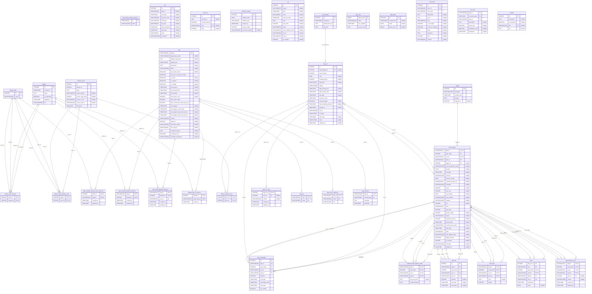

# codefights
all solutions that I wrote using Python3 to get ninja's level in codefights

```mermaid
erDiagram
  dataset_alias_dataset {
    INTEGER alias_id PK,FK
    INTEGER dataset_id PK,FK
  }

  dataset_alias_dataset_event {
    INTEGER alias_id PK,FK
    INTEGER event_id PK,FK
  }

  dataset_alias {
    INTEGER id PK
    VARCHAR(3000) name
  }

  dataset {
    INTEGER id PK
    TIMESTAMP created_at
    TEXT extra
    BOOLEAN is_orphaned
    TIMESTAMP updated_at
    VARCHAR(3000) uri
  }

  dag_schedule_dataset_alias_reference {
    INTEGER alias_id PK,FK
    VARCHAR(250) dag_id PK,FK
    TIMESTAMP created_at
    TIMESTAMP updated_at
  }

  dag_schedule_dataset_reference {
    VARCHAR(250) dag_id PK,FK
    INTEGER dataset_id PK,FK
    TIMESTAMP created_at
    TIMESTAMP updated_at
  }

  task_outlet_dataset_reference {
    VARCHAR(250) dag_id PK,FK
    INTEGER dataset_id PK,FK
    VARCHAR(250) task_id PK
    TIMESTAMP created_at
    TIMESTAMP updated_at
  }

  dataset_dag_run_queue {
    INTEGER dataset_id PK,FK
    VARCHAR(250) target_dag_id PK,FK
    TIMESTAMP created_at
  }

  dagrun_dataset_event {
    INTEGER dag_run_id PK,FK
    INTEGER event_id PK,FK
  }

  dataset_event {
    INTEGER id PK
    INTEGER dataset_id
    TEXT extra
    VARCHAR(250) source_dag_id "nullable"
    INTEGER source_map_index "nullable"
    VARCHAR(250) source_run_id "nullable"
    VARCHAR(250) source_task_id "nullable"
    TIMESTAMP timestamp
  }

  dag_priority_parsing_request {
    VARCHAR(32) id PK
    VARCHAR(2000) fileloc
  }

  job {
    INTEGER id PK
    VARCHAR(250) dag_id "nullable"
    TIMESTAMP end_date "nullable"
    VARCHAR(500) executor_class "nullable"
    VARCHAR(500) hostname "nullable"
    VARCHAR(30) job_type "nullable"
    TIMESTAMP latest_heartbeat "nullable"
    TIMESTAMP start_date "nullable"
    VARCHAR(20) state "nullable"
    VARCHAR(1000) unixname "nullable"
  }

  slot_pool {
    INTEGER id PK
    TEXT description "nullable"
    BOOLEAN include_deferred
    VARCHAR(256) pool UK "nullable"
    INTEGER slots "nullable"
  }

  callback_request {
    INTEGER id PK
    JSON callback_data
    VARCHAR(20) callback_type
    TIMESTAMP created_at
    INTEGER priority_weight
    VARCHAR(2000) processor_subdir "nullable"
  }

  log {
    INTEGER id PK
    VARCHAR(250) dag_id "nullable"
    TIMESTAMP dttm "nullable"
    VARCHAR(60) event "nullable"
    TIMESTAMP execution_date "nullable"
    TEXT extra "nullable"
    INTEGER map_index "nullable"
    VARCHAR(500) owner "nullable"
    VARCHAR(500) owner_display_name "nullable"
    VARCHAR(250) run_id "nullable"
    VARCHAR(250) task_id "nullable"
    INTEGER try_number "nullable"
  }

  rendered_task_instance_fields {
    VARCHAR(250) dag_id PK,FK
    INTEGER map_index PK,FK
    VARCHAR(250) run_id PK,FK
    VARCHAR(250) task_id PK,FK
    TEXT k8s_pod_yaml "nullable"
    TEXT rendered_fields
  }

  task_fail {
    INTEGER id PK
    VARCHAR(250) dag_id FK
    INTEGER map_index FK
    VARCHAR(250) run_id FK
    VARCHAR(250) task_id FK
    INTEGER duration "nullable"
    TIMESTAMP end_date "nullable"
    TIMESTAMP start_date "nullable"
  }

  task_map {
    VARCHAR(250) dag_id PK,FK
    INTEGER map_index PK,FK
    VARCHAR(250) run_id PK,FK
    VARCHAR(250) task_id PK,FK
    JSON keys "nullable"
    INTEGER length
  }

  task_reschedule {
    INTEGER id PK
    VARCHAR(250) dag_id FK
    INTEGER map_index FK
    VARCHAR(250) run_id FK
    VARCHAR(250) task_id FK
    INTEGER duration
    TIMESTAMP end_date
    TIMESTAMP reschedule_date
    TIMESTAMP start_date
    INTEGER try_number
  }

  xcom {
    INTEGER dag_run_id PK
    VARCHAR(512) key PK
    INTEGER map_index PK,FK
    VARCHAR(250) task_id PK,FK
    VARCHAR(250) dag_id FK
    VARCHAR(250) run_id FK
    TIMESTAMP timestamp
    BLOB value "nullable"
  }

  task_instance {
    VARCHAR(250) dag_id PK,FK
    INTEGER map_index PK
    VARCHAR(250) run_id PK,FK
    VARCHAR(250) task_id PK
    INTEGER trigger_id FK "nullable"
    VARCHAR(1000) custom_operator_name "nullable"
    FLOAT duration "nullable"
    TIMESTAMP end_date "nullable"
    VARCHAR(1000) executor "nullable"
    BLOB executor_config "nullable"
    VARCHAR(250) external_executor_id "nullable"
    VARCHAR(1000) hostname "nullable"
    INTEGER job_id "nullable"
    INTEGER max_tries "nullable"
    JSON next_kwargs "nullable"
    VARCHAR(1000) next_method "nullable"
    VARCHAR(1000) operator "nullable"
    INTEGER pid "nullable"
    VARCHAR(256) pool
    INTEGER pool_slots
    INTEGER priority_weight "nullable"
    VARCHAR(256) queue "nullable"
    INTEGER queued_by_job_id "nullable"
    TIMESTAMP queued_dttm "nullable"
    VARCHAR(250) rendered_map_index "nullable"
    TIMESTAMP start_date "nullable"
    VARCHAR(20) state "nullable"
    VARCHAR(2000) task_display_name "nullable"
    DATETIME trigger_timeout "nullable"
    INTEGER try_number "nullable"
    VARCHAR(1000) unixname "nullable"
    TIMESTAMP updated_at "nullable"
  }

  task_instance_note {
    VARCHAR(250) dag_id PK,FK
    INTEGER map_index PK,FK
    VARCHAR(250) run_id PK,FK
    VARCHAR(250) task_id PK,FK
    INTEGER user_id FK "nullable"
    VARCHAR(1000) content "nullable"
    TIMESTAMP created_at
    TIMESTAMP updated_at
  }

  log_template {
    INTEGER id PK
    TIMESTAMP created_at
    TEXT elasticsearch_id
    TEXT filename
  }

  dag_run {
    INTEGER id PK
    INTEGER log_template_id FK "nullable"
    INTEGER clear_number
    BLOB conf "nullable"
    INTEGER creating_job_id "nullable"
    VARCHAR(32) dag_hash "nullable"
    VARCHAR(250) dag_id
    TIMESTAMP data_interval_end "nullable"
    TIMESTAMP data_interval_start "nullable"
    TIMESTAMP end_date "nullable"
    TIMESTAMP execution_date
    BOOLEAN external_trigger "nullable"
    TIMESTAMP last_scheduling_decision "nullable"
    TIMESTAMP queued_at "nullable"
    VARCHAR(250) run_id
    VARCHAR(50) run_type
    TIMESTAMP start_date "nullable"
    VARCHAR(50) state "nullable"
    TIMESTAMP updated_at "nullable"
  }

  dag_run_note {
    INTEGER dag_run_id PK,FK
    INTEGER user_id FK "nullable"
    VARCHAR(1000) content "nullable"
    TIMESTAMP created_at
    TIMESTAMP updated_at
  }

  dag_code {
    BIGINT fileloc_hash PK
    VARCHAR(2000) fileloc
    TIMESTAMP last_updated
    TEXT source_code
  }

  dag_pickle {
    INTEGER id PK
    TIMESTAMP created_dttm "nullable"
    BLOB pickle "nullable"
    BIGINT pickle_hash "nullable"
  }

  dag_tag {
    VARCHAR(250) dag_id PK,FK
    VARCHAR(100) name PK
  }

  dag_owner_attributes {
    VARCHAR(250) dag_id PK,FK
    VARCHAR(500) owner PK
    VARCHAR(500) link
  }

  dag {
    VARCHAR(250) dag_id PK
    VARCHAR(2000) dag_display_name "nullable"
    TEXT dataset_expression "nullable"
    VARCHAR(25) default_view "nullable"
    TEXT description "nullable"
    VARCHAR(2000) fileloc "nullable"
    BOOLEAN has_import_errors "nullable"
    BOOLEAN has_task_concurrency_limits
    BOOLEAN is_active "nullable"
    BOOLEAN is_paused "nullable"
    BOOLEAN is_subdag "nullable"
    TIMESTAMP last_expired "nullable"
    TIMESTAMP last_parsed_time "nullable"
    TIMESTAMP last_pickled "nullable"
    INTEGER max_active_runs "nullable"
    INTEGER max_active_tasks
    INTEGER max_consecutive_failed_dag_runs
    TIMESTAMP next_dagrun "nullable"
    TIMESTAMP next_dagrun_create_after "nullable"
    TIMESTAMP next_dagrun_data_interval_end "nullable"
    TIMESTAMP next_dagrun_data_interval_start "nullable"
    VARCHAR(2000) owners "nullable"
    INTEGER pickle_id "nullable"
    VARCHAR(2000) processor_subdir "nullable"
    VARCHAR(250) root_dag_id "nullable"
    TEXT schedule_interval "nullable"
    BOOLEAN scheduler_lock "nullable"
    VARCHAR(1000) timetable_description "nullable"
  }

  connection {
    INTEGER id PK
    VARCHAR(250) conn_id UK
    VARCHAR(500) conn_type
    TEXT description "nullable"
    TEXT extra "nullable"
    VARCHAR(500) host "nullable"
    BOOLEAN is_encrypted "nullable"
    BOOLEAN is_extra_encrypted "nullable"
    TEXT login "nullable"
    TEXT password "nullable"
    INTEGER port "nullable"
    VARCHAR(500) schema "nullable"
  }

  dag_warning {
    VARCHAR(250) dag_id PK,FK
    VARCHAR(50) warning_type PK
    TEXT message
    TIMESTAMP timestamp
  }

  sla_miss {
    VARCHAR(250) dag_id PK
    TIMESTAMP execution_date PK
    VARCHAR(250) task_id PK
    TEXT description "nullable"
    BOOLEAN email_sent "nullable"
    BOOLEAN notification_sent "nullable"
    TIMESTAMP timestamp "nullable"
  }

  trigger {
    INTEGER id PK
    VARCHAR(1000) classpath
    TIMESTAMP created_date
    TEXT kwargs
    INTEGER triggerer_id "nullable"
  }

  variable {
    INTEGER id PK
    TEXT description "nullable"
    BOOLEAN is_encrypted "nullable"
    VARCHAR(250) key UK "nullable"
    TEXT val "nullable"
  }

  dataset_alias ||--o{ dataset_alias_dataset : alias_id
  dataset_alias ||--o{ dataset_alias_dataset : alias_id
  dataset ||--o{ dataset_alias_dataset : dataset_id
  dataset ||--o{ dataset_alias_dataset : dataset_id
  dataset_alias ||--o{ dataset_alias_dataset_event : alias_id
  dataset_alias ||--o{ dataset_alias_dataset_event : alias_id
  dataset_event ||--o{ dataset_alias_dataset_event : event_id
  dataset_event ||--o{ dataset_alias_dataset_event : event_id
  dataset_alias ||--o{ dag_schedule_dataset_alias_reference : alias_id
  dag ||--o{ dag_schedule_dataset_alias_reference : dag_id
  dataset ||--o{ dag_schedule_dataset_reference : dataset_id
  dag ||--o{ dag_schedule_dataset_reference : dag_id
  dataset ||--o{ task_outlet_dataset_reference : dataset_id
  dag ||--o{ task_outlet_dataset_reference : dag_id
  dataset ||--o{ dataset_dag_run_queue : dataset_id
  dag ||--o{ dataset_dag_run_queue : target_dag_id
  dag_run ||--o{ dagrun_dataset_event : dag_run_id
  dataset_event ||--o{ dagrun_dataset_event : event_id
  task_instance ||--o{ rendered_task_instance_fields : dag_id
  task_instance ||--o{ rendered_task_instance_fields : task_id
  task_instance ||--o{ rendered_task_instance_fields : run_id
  task_instance ||--o{ rendered_task_instance_fields : map_index
  task_instance ||--o{ task_fail : task_id
  task_instance ||--o{ task_fail : dag_id
  task_instance ||--o{ task_fail : run_id
  task_instance ||--o{ task_fail : map_index
  task_instance ||--o{ task_map : dag_id
  task_instance ||--o{ task_map : task_id
  task_instance ||--o{ task_map : run_id
  task_instance ||--o{ task_map : map_index
  task_instance ||--o{ task_reschedule : task_id
  task_instance ||--o{ task_reschedule : dag_id
  dag_run }o--o{ task_reschedule : dag_id
  dag_run }o--o{ task_reschedule : run_id
  task_instance ||--o{ task_reschedule : run_id
  task_instance ||--o{ task_reschedule : map_index
  task_instance ||--o{ xcom : task_id
  task_instance ||--o{ xcom : map_index
  task_instance ||--o{ xcom : dag_id
  task_instance ||--o{ xcom : run_id
  dag_run }o--o{ task_instance : dag_id
  dag_run }o--o{ task_instance : run_id
  trigger ||--o{ task_instance : trigger_id
  task_instance ||--o{ task_instance_note : task_id
  task_instance ||--o{ task_instance_note : dag_id
  task_instance ||--o{ task_instance_note : run_id
  task_instance ||--o{ task_instance_note : map_index
  log_template ||--o{ dag_run : log_template_id
  dag_run ||--o{ dag_run_note : dag_run_id
  dag ||--o{ dag_tag : dag_id
  dag ||--o{ dag_owner_attributes : dag_id
  dag ||--o{ dag_warning : dag_id
```
